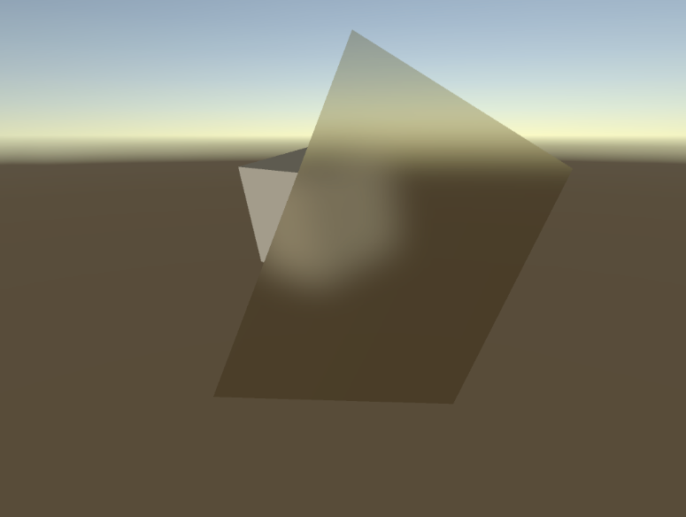

## Universal Render Pipeline Kawase Blur Renderer Extension

This is a experimental RenderFeature implementation aiming to show multiple things:
* PostProcessing "like" effect in URP using ScriptableRenderFeatures
* how to render multiple passes using CommandBuffers in RenderFeatures
* how to do a simple yet effective blur, based on the Kawase blur as described in this [article](https://software.intel.com/en-us/blogs/2014/07/15/an-investigation-of-fast-real-time-gpu-based-image-blur-algorithms).

Features:
* flexible downscaling
* variable number of blur passes
* store result in a temporary texture of blit to the current framebuffer
* simple milky-glass demo

This is how it looks.

Developed with Unity 2019.3
